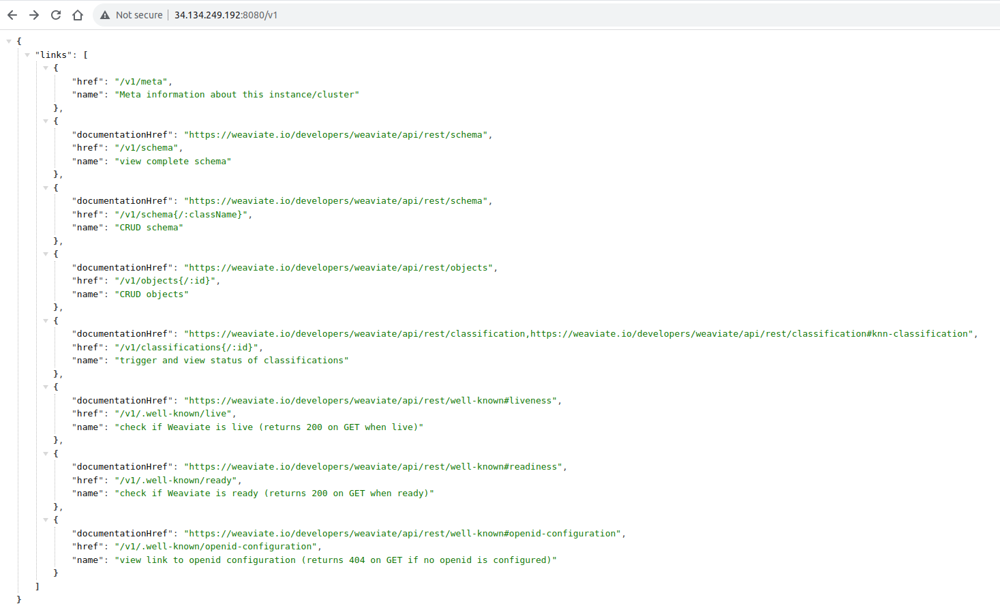

# Deploy weaviate with Docker Compose

Weaviate supports deployment with Docker Compose, which allows you to run Weaviate on any OS supported by Docker.
To start Weaviate with Docker, you can use a Docker Compose file, typically called `docker-compose.yml`. 
You can use the (link)Docker Compose playbook


# How to run it

To execute the playbook run the following command :

```bash
ansible-playbook -i /path/to/inventory weaviate.yml
```

# What happens in the background to your machines when you run the playbook

The `weaviate.yml` playbook will do the following:
 * Copy Docker Compose file to the target machine
 * Start Weaviate services with Docker Compose


# Accessing the weaviate dashboard

To access the Weaviate dashboard follow these steps:
* Obtain the VM External IP Address : First, obtain the external IP address of your virtual machine (VM) where Weaviate is hosted. This IP address is provided by your cloud provider or network administrator.
* Use Port 8080 : Weaviate's dashboard is accessible on port 8080. Ensure that this port is open and accessible in your network or firewall settings.
* Access the Dashboard : Open your web browser and enter the following URL in the address bar, replacing vm_external_ipaddr with the actual external IP address of your VM:

```bash
  http://vm_external_ipaddr:8080
```

# Expected Output



